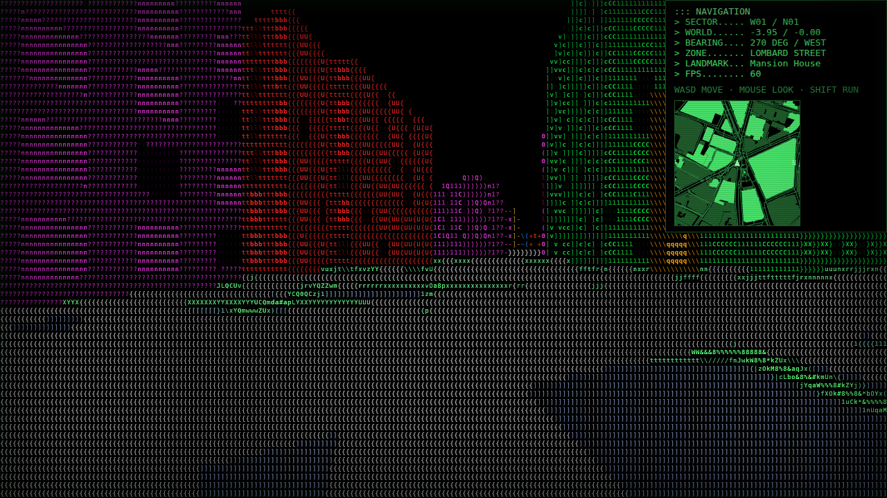

# AsciiCity



A static browser minigame: walk around the City of London in first person,
rendered as coloured ASCII glyphs with a green NAVIGATION HUD. Built with Vite,
TypeScript and three.js; deployed as static files to GitHub Pages.

## Running

```sh
npm run dev        # start the Vite dev server (http://127.0.0.1:5173)
```

## How to play

Open the served URL, click the `CLICK TO ENTER` overlay to enter the world;
the browser will grab pointer lock so mouse movement steers the view. Press
`Escape` to release the pointer — a smaller `CLICK TO RESUME` overlay lets you
re-enter.

- `W` / `↑` — forward, `S` / `↓` — back
- `A` / `D` — strafe left / right
- `←` / `→` — turn left / right
- `Shift` — sprint
- Mouse — look

URL parameters (documented in [`docs/integration.md`](docs/integration.md)):

- `?synthetic=1` — skip `city.json` and use the deterministic synthetic grid.
- `?seed=N` — seed passed to `syntheticCity(seed)`.
- `?cell=WxH` — override the ASCII cell size in pixels, e.g. `?cell=8x16`.
- `?crt=0` — disable the CRT scanline / vignette overlay (on by default).
- `?minimap=0` — hide the heading-up minimap (top-left panel; on by default).
- `?hud=0` — hide the NAVIGATION panel (on by default).
- `?render=<id>` — start in a given look (`ascii`, `gloom`, `solarized`, …).
- `?at=<name>` — spawn at a landmark preset (`bank`, `stpauls`, `gherkin`,
  `monument`, `tower`, `barbican`, `liverpoolst`, `leadenhall`, `bigben`,
  `parliament`, `trafalgar`, `embankment`, `walkietalkie`, `lloyds`) or at a coordinate
  `?at=lon,lat[,bearing]`, e.g. `?at=gherkin` or `?at=-0.0984,51.5138,90`.
  Named-building presets (`gherkin`, `stpauls`, …) are resolved from
  `city.json` — spawn on the nearest road ~70 m from the building, facing
  it; if the building is absent they fall back to `bigben`.
  With no `?at=` the game starts on Westminster Bridge facing Big Ben.
  Ignored with `?synthetic=1`.

See [`docs/integration.md`](docs/integration.md) for the full parameter list
and preset table.

The NAVIGATION panel (top-right) shows SECTOR, WORLD position, BEARING with
8-way compass, ZONE (nearest named road or place), LANDMARK (named building
in view, or `-`), FPS (1 s moving average). A heading-up minimap of nearby
streets sits top-left. Press `H` / `M` to hide the HUD / minimap; the ⚙
button (bottom-right, including on phones) opens the settings menu
(HUD / MINIMAP / CRT / STYLE / FLY toggles, copy-link, switch city).

## Social preview

`public/og.png` is the committed 1200×630 social-preview image that X, Reddit
and Slack use when an AsciiCity link is shared (the Open Graph / Twitter meta
in `index.html` points at it, served from `/asciicity/og.png` on GitHub
Pages). Regenerate it with:

```sh
node scripts/make-og.mjs
```

This boots a throwaway Vite server, screenshots the London default spawn at
night (`?time=22:30`), and rewrites `public/og.png` — commit the result with
the change.

## Analytics

The page loads the Cloudflare Web Analytics beacon
(`static.cloudflareinsights.com/beacon.min.js`, cookieless, client-side only)
from `index.html`. Removing that one `<script>` line disables it.

## Credits / rebranding

The footer author and repo URL live in [`src/credits.ts`](src/credits.ts) —
edit that file to rebrand.

The `matrix` render style's katakana glyphs are 8×16 bitmaps derived from
[GNU Unifont](https://unifoundry.com/unifont/) (dual-licensed SIL OFL 1.1 /
GPL v2+ with the font-embedding exception).

© 2026 [@ubyjvovk](https://github.com/ubyjvovk). All rights reserved —
license to be decided.

## Tests

```sh
bash .tigerteam/scripts/run-tests.sh   # unit tests (vitest)
npm run check                          # full gate: typecheck + unit + build + e2e
```

## Data

`public/data/city.json` is generated from OpenStreetMap by `npm run fetch-data`
— do not hand-edit it.
